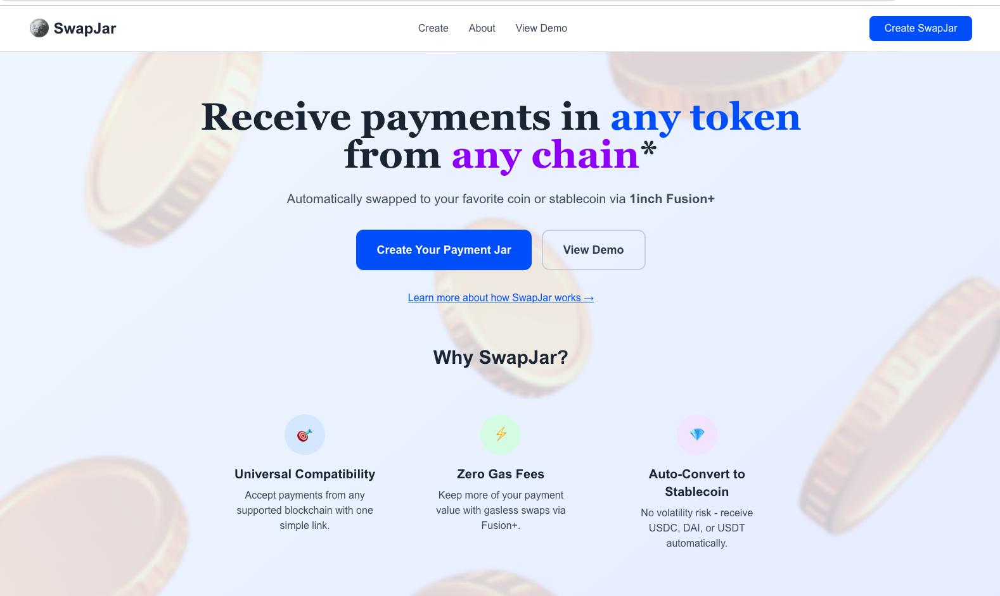
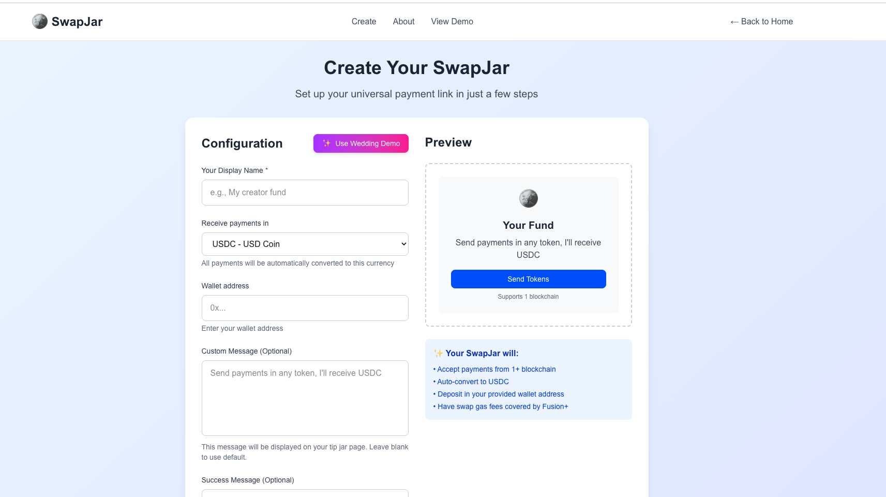
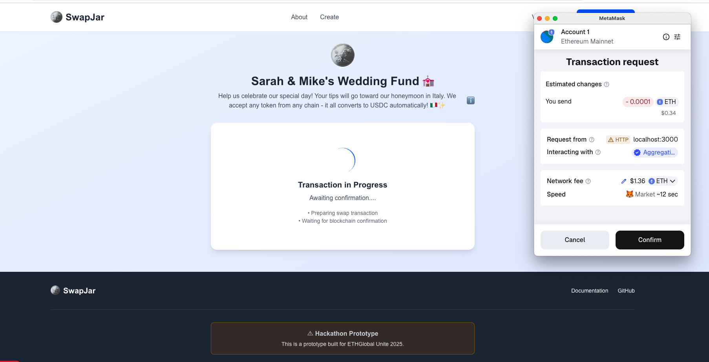
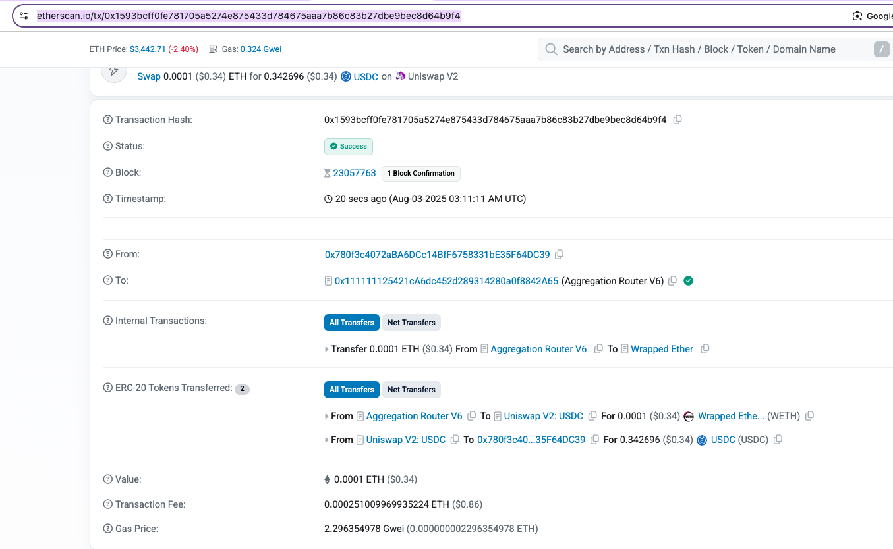
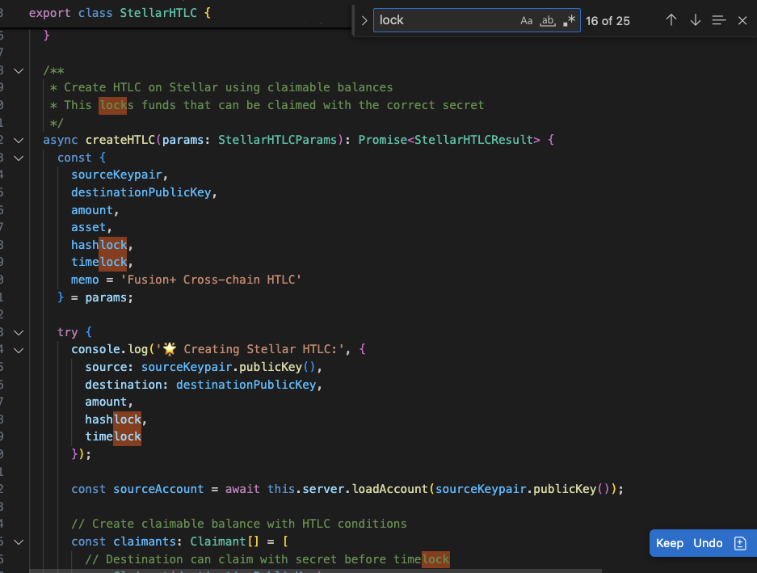

  

 

# SwapJar

**Receive payments in *any* token from *any* chain, automatically swapped to your favorite stablecoin via 1inch Fusion+.**

SwapJar is a crypto-native payment collection platform for creators, wedding funds, freelancers, and DAOs. With one simple IPFS-backed link, anyone can send payments in any token — even from non-EVM chains like **Stellar** — and the receiver will automatically get their chosen **stablecoin** (USDC, DAI, etc.) using **1inch Fusion+** cross-chain swaps.

Example page: https://swapjar.vercel.app/tip/bafkreibjvuqemz7ajpwabr62kmpgglx636knrn4ybbffwtcwfsi3i5ypam

Demo url: https://swapjar.vercel.app

Demo video:

Example transaction through SwapJar from ETH sender to USDC recipient mainnet: https://etherscan.io/tx/0x1593bcff0fe781705a5274e875433d784675aaa7b86c83b27dbe9bec8d64b9f4

Example swap + bridge payment through mainnet to stellar (mainnet): https://steexp.com/account/GAIFMUVXX73LCIC7RWEQJKNZF6DBI7VBOVMZUACHPZ3ZFBEYWL75IMIF/payments

Built for the Ethglobal Unite Defi hackathon 2025.

### Going after the below prizes

-  **1inch – Fullstack dApp using APIs and Fusion+**
-  **1inch – Fusion+ Extension (non-EVM chain: Stellar)**
-  **Stellar – Best use of Stellar x 1inch**

---

<!-- ### Discussion of existing solutions and why they fall short -->

Current payment collection solutions in crypto face several critical limitations:

- **Single-chain constraint**: Most payment jars only accept tokens from one blockchain, forcing users to hold specific assets or pay bridge fees manually
- **Token volatility risk**: Recipients often receive volatile tokens (ETH, random memecoins) instead of stable value, creating unwanted exposure
- **High gas costs**: Traditional swaps require recipients to pay gas fees to convert payments to stablecoins, eating into small payment amounts
- **Poor UX for non-crypto users**: Supporters need to understand specific tokens, networks, and wallet management
- **Limited cross-chain support**: No seamless way for users on non-EVM chains (like Stellar) to send payments to EVM users
- **Manual conversion overhead**: Recipients must manually swap each payment, creating friction and ongoing maintenance

### Solution

SwapJar solves these problems by creating a **universal, gasless payment collection experience** powered by 1inch Fusion+ and IPFS:

**🎯 One Link, Any Token**: Recipients create a single IPFS-backed shareable link that accepts payments in ANY token from multiple chains (Ethereum, Base, Optimism, Stellar), removing blockchain complexity for supporters.

**🎨 Perfect for Creators & Events**: Whether you're a content creator collecting fan support, a couple setting up a wedding fund, or a freelancer receiving project payments, SwapJar handles multi-chain payments seamlessly.

**⚡ Gasless Auto-Swaps**: Using 1inch Fusion+, all incoming payments are automatically swapped to the recipient's preferred stablecoin without them paying any gas fees, ensuring they keep 100% of the payment value.

**🌉 Cross-Chain Bridge Integration**: We extended Fusion+ capabilities to support Stellar through our custom bridge integration with Circle CCTP and Allbridge, allowing XLM and Stellar USDC holders to seamlessly send payments to EVM users.

**💰 Stable Value Guarantee**: Recipients always receive stablecoins (USDC, DAI, USDT), eliminating volatility risk and providing predictable value.

**🔄 Intent-Based Architecture**: Leveraging Fusion+ intent-based swaps means better prices, MEV protection, and no failed transactions due to slippage.

### Challenges we ran into

**Cross-Chain Complexity**: Integrating Stellar with EVM chains required building custom bridge monitoring and CCTP integration. We had to handle different transaction finality models and ensure atomic cross-chain operations.

**Fusion+ Integration**: Working with intent-based swaps required understanding the order flow and properly handling order settlement timing. We needed to build robust monitoring to track order status and handle edge cases.

**Gas Optimization**: Even though Fusion+ is gasless for users, our backend relay service needed to optimize gas costs for posting intents and bridging operations while maintaining profitability.

**Wallet UX**: Supporting both EVM (WalletConnect) and Stellar (Freighter) wallets in a single interface required careful state management and error handling for different wallet connection patterns.

**Real-time Updates**: Building a responsive UI that shows swap progress across multiple chains and APIs required implementing WebSocket connections and proper state synchronization.

---

## 🎯 Project Goals

- Create a production-ready **payment collection app** powered by 1inch
- Use as many **1inch APIs** as possible: Fusion+ Swap, Price Feeds, Token Metadata, Wallet Balances, Web3
- **Extend Fusion+ cross-chain swap support** to **Stellar** via custom bridge integration
- Offer a simple and gas-efficient payment experience for both EVM and non-EVM users with **IPFS-backed** payment links

---

## 🔄 How It Works

### ✨ 1. User Creates a Payment Collection Link
- Sets wallet address, preferred stablecoin
- Generates IPFS-backed shareable link (e.g., `https://swapjar.vercel.app/tip/bafkrei...`)
- Perfect for creator donation pages, wedding registries, freelance invoices

### 💸 2. Supporter Sends Payment
- Supports *any* ERC-20 token from Ethereum, Optimism, Base
- Supports **USDC or XLM from Stellar** via custom bridge integration

### 🔁 3. Tokens Swapped Automatically via Fusion+
- **EVM tokens** are swapped via **1inch Fusion+** into stablecoin
- **Stellar payments** are bridged to EVM (via Circle CCTP), then swapped via Fusion+

### ✅ 4. Receiver Gets Stablecoin
- Recipient receives stablecoin (e.g., USDC) in their wallet

---

## 🔌 1inch APIs Used

| API                  | Use                                                |
|----------------------|-----------------------------------------------------|
| `Fusion+ Swap API`   | Used to create gasless, intent-based swaps          |
| `Token Metadata API` | Shows logos, symbols, decimals                      |
| `Price Quotes API`    | Used to calculate payment equivalent (e.g., $10 in any token) |
| `Wallet Balances API`| Display real-time wallet status                    |
| `Web3 API`           | Submit Fusion+ swap transactions from backend or relayer |

---

## 🌉 Fusion+ Extension: Stellar Integration

We built a **Fusion+ extension** that allows users on **Stellar** to send payments to EVM users with XLM or USDC. Our custom bridge backend:

- Monitors Stellar wallets for incoming payments
- Bridges to Ethereum using **Circle CCTP** (USDC) or **Allbridge**
- Posts swap intents via **1inch Fusion+**
- Confirms swap and notifies the recipient

---

## 🎯 Use Cases

**👨‍🎨 Content Creators**: Streamers, YouTubers, and social media influencers can share a single IPFS-backed payment link accepting any token from any supported chain, automatically converted to stable value.

**💒 Wedding Funds**: Couples can create decentralized wedding registries where guests from different blockchain ecosystems can contribute using their preferred tokens, all consolidated into stablecoins.

**💼 Freelancers**: Accept project payments in any token without worrying about volatility or manual conversion overhead.

**🏢 DAOs & Organizations**: Collect contributions, grants, or membership fees across multiple chains with automatic stablecoin conversion.

---

### Useful links
* https://ethglobal.com/events/unite/prizes#1inch
* https://portal.1inch.dev/documentation/overview

---

## 📸 Screenshots

### Home Page
*Shows the main SwapJar home page*

### Creating a Payment Collection Link
*Shows the setup process*

### QR Code Payment Page
*Shows the payment collection interface*

### Sending Payment to Page
*Shows the payment sending process*

### 1inch Fusion+ Swap Integration
*Shows the swap functionality*

### Stellar Bridge Integration
*Shows the cross-chain bridge feature*

